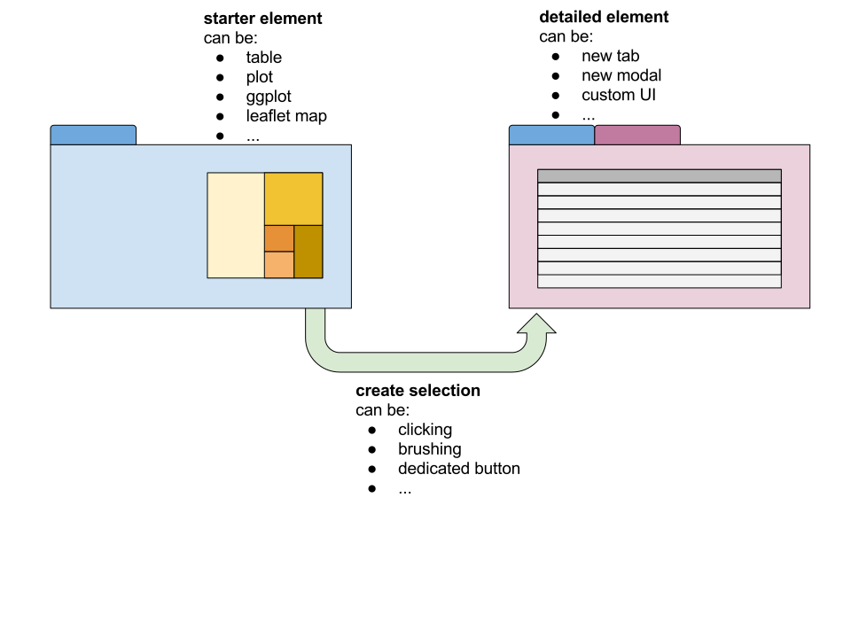

```{r, echo = FALSE}
library(ggplot2)

thm <- theme_bw() + 
  theme(
    panel.background = element_rect(fill = "transparent", colour = NA), 
    plot.background = element_rect(fill = "transparent", colour = NA),
    legend.background = element_rect(fill = "transparent", colour = NA),
    legend.key = element_rect(fill = "transparent", colour = NA),
    legend.position = "bottom"
  )
theme_set(thm)

```

# Overview 

<!-- ABSTRACT
Data science is often thought as _building up_ from data. However there are many cases where going the other away around, and _drilling down_ into the data, can also be extremely useful. Have you ever seen a plot where something seems off? Maybe it's a few egregious outliers or a quirk in the expected trend. Instead of going back to the drawing board immediately, returning to the spreadsheets of data and trying other visualizations and summaries, you can leverage the power of Shiny to allow you to interactively start from an aggregate visualization (or summary) and then drill down into the lower-level, finer-grained data. Whether it is by interactively creating new tabs, modal windows or other methods, _drilling down_ allows you to discover data that's been right under your nose, without having to leave your Shiny app. This capability also allows for more satisfying data presentation or data reporting Shiny apps, since its consumers can investigate the data to their heart's content. This talk will cover how you can create drilldown Shiny apps, using functions like `insertUI` and `removeUI`, `appendTab` and `removeTab`, and `showModal`.
-->

**PART I**

In the context of data, what is:

  - drilling down? drilling through? drilling up?
  - _Plan_: "show, don't tell": demo illustrative Shiny app

**PART II**

Let's talk about abstractions

  - _Plan_: diagrams!

# Demo time

- All of our "drillings" (down/through/up) will be demoed in this app
- All of our "drillings" are also implemented through dynamic UI

**Relevant functions**:

  - `appendTab` and `removeTab`
  - `showModal` and `removeModal`
  - `insertUI` and `removeUI`.

# Abstractions



# Thanks!

Any questions?